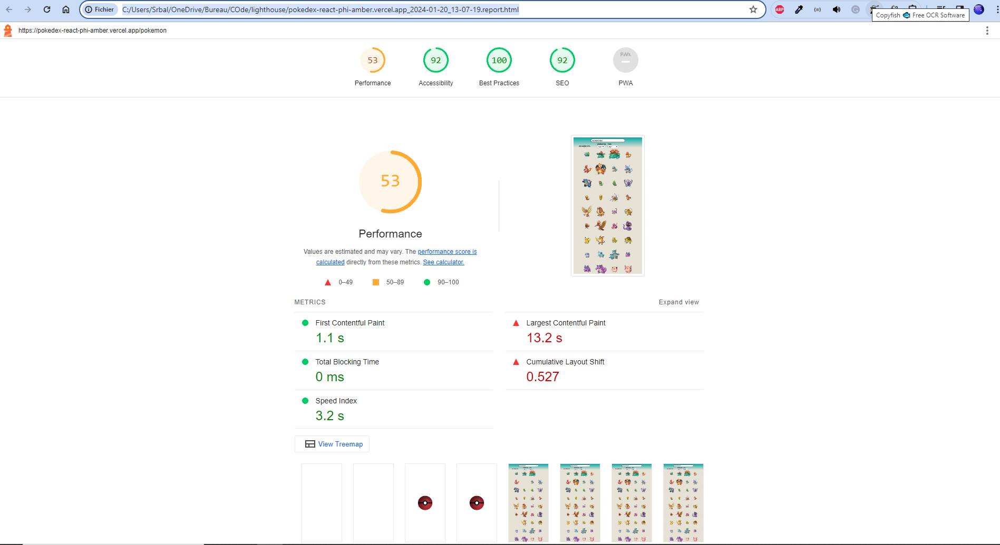
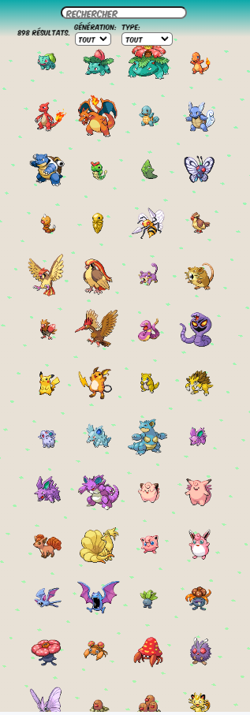
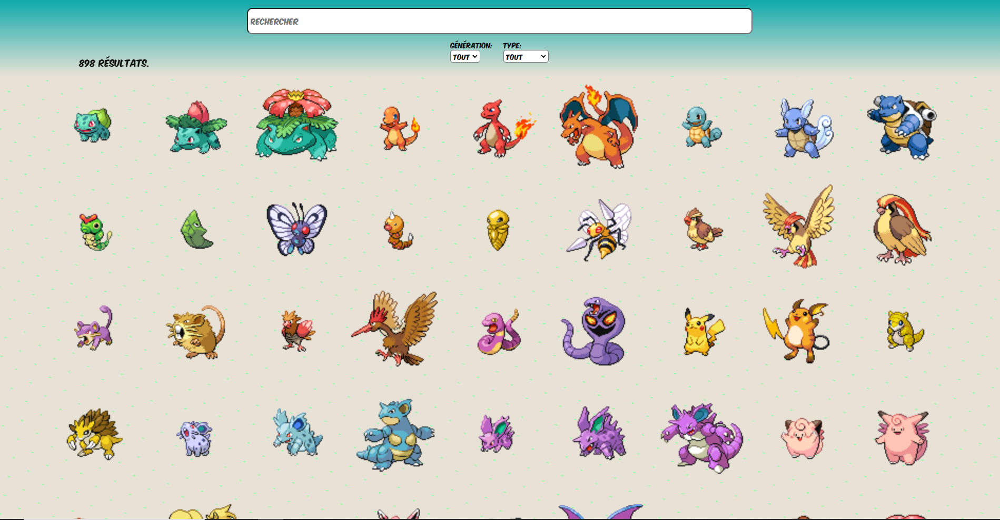

# Pokedex

## Fr

### Description

Pokedex: accès à toutes les données de tout les pokemons des 8 premières génération.

### Détails

Voici mon premier projet avec react. J'ai préféré commencé par quelques chose qui m'était familier. Les données proviennent d'une api (https://pokebuildapi.fr/api/v1) gratuite.
J'ai utilisé react et quelques animations ont été faites avec gsap.

Je vous laisse le découvrir [ici](https://pokedex-react-phi-amber.vercel.app)

## En

This is my first react project. I decided to make a pokedex to practice in react. Datas is from a free [api](https://pokebuildapi.fr/api/v1). I used react and gsap for some animation.

Visit it [here](https://pokedex-react-phi-amber.vercel.app)

### Technologies: React.JS, Node.Js, Greensock

### Images

